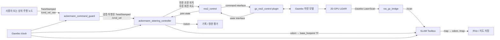
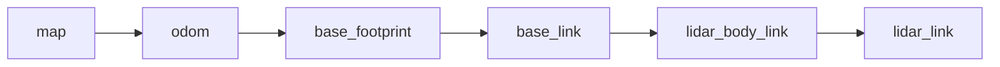

# Ackermann 차량 기반 ROS 2 SLAM 프로젝트 보고서 작성 요소

> 작성 기준일: 2026-07-31<br>
> 문서 성격: 최종 보고서를 쓰기 위한 **검증 사실, 목차, 표·그림 계획, 실험 항목, 근거 파일 모음**<br>
> 대상 구현: ROS 2 Jazzy + Gazebo Harmonic + Ackermann 조향 + 2D LiDAR + SLAM Toolbox

## 1. 이 문서의 사용 방법

보고서를 작성할 때 각 문장과 수치를 다음 세 등급으로 구분한다.

| 표기 | 의미 | 보고서 반영 방법 |
|---|---|---|
| `[검증]` | 코드, 설정, 정적 검사 또는 실행 결과로 확인됨 | 결과 또는 구현 사실로 서술 가능 |
| `[가정]` | 원본 CAD 정보가 없어 추정한 값 | 반드시 “가정 기반”이라고 명시 |
| `[측정 필요]` | 현재 구현에는 있으나 정량 실험값이 없음 | 실험 후 값과 측정 조건을 채움 |

다음 표현은 현재 근거 수준에서 사용하지 않는다.

- “실차 적용이 완료되었다.”
- “CAD 원본과 기구학적으로 완전히 일치한다.”
- “지도 정확도가 검증되었다.”
- “Nav2 자율주행이 구현되었다.”
- “제품 또는 생산 환경에 사용할 수 있다.”

현재 시스템은 **시뮬레이션에서 실행·저장·재로딩까지 검증한 가정 기반 모델**이다.

---

## 2. 보고서 기본 정보

### 2.0 출발 자료

- `[검증]` 프로젝트 시작 시 제공 자료는 16쪽의 비암호화 PDF 계획서 1개와 binary STL 10개였다.
- `[검증]` 제공 자료에는 바로 빌드할 수 있는 ROS 2 구현 코드가 없었으며, 현재 workspace는 교정된 계획을 바탕으로 새로 구성하였다.
- PDF 검토에서는 파일명 대응, CAD 단위·축·pivot, Ackermann 기준 프레임과 기구학, launch/world/bridge, TF·simulation time·명령 message type, occupancy map과 pose graph의 구분을 보완하였다.
- 이는 원 계획서의 전면 부정이나 공식 인증을 뜻하지 않고, 구현 가능성과 내부 일관성을 높이기 위한 기술 교정이다.

### 2.1 제목 후보

1. **ROS 2 Jazzy와 Gazebo Harmonic을 이용한 Ackermann 조향 차량의 2D LiDAR SLAM 시뮬레이션**
2. **Ackermann 기구학 제약과 안전 명령 처리기를 포함한 ROS 2 기반 SLAM 시스템 구현**
3. **CAD Mesh 기반 Ackermann 차량 모델링 및 SLAM Toolbox 지도 작성 워크플로우**

### 2.2 한 문장 요약

제공된 STL 형상을 ROS 좌표계에 맞게 정규화하고 Ackermann 차량 모델, 안전 명령 처리기, 2D LiDAR 및 SLAM Toolbox를 통합하여 Gazebo에서 지도 작성부터 pose graph 재로딩까지 가능한 ROS 2 Jazzy 워크플로우를 구현하였다.

### 2.3 핵심 기여 후보

- 단일 기하 정본 파일에서 URDF 및 controller 설정을 생성하는 재현 가능한 모델링 파이프라인
- 내·외륜 조향각과 후륜 속도 차동을 반영한 Ackermann 차량 시뮬레이션
- 입력 신선도, 곡률, 조향각, 속도 및 가속도 제약을 적용하는 command guard
- Gazebo 2D LiDAR, odometry, TF 및 SLAM Toolbox를 통합한 mapping/localization 실행 경로
- mesh, YAML, URDF/SDF, launch, controller, 주행, 지도 저장·재로딩을 포함한 단계별 검증

### 2.4 연구 질문

1. 제공된 STL만으로 ROS 2/Gazebo에서 사용할 수 있는 Ackermann 차량 모델을 어떻게 재구성할 수 있는가?
2. Ackermann 기구학 제약을 만족하도록 속도 명령을 어떻게 변환하고 제한할 수 있는가?
3. 차량 odometry와 2D LiDAR를 SLAM Toolbox에 연결하여 일관된 TF 및 지도를 생성할 수 있는가?
4. 지도와 pose graph를 저장한 뒤 새 localization 프로세스에서 재사용할 수 있는가?
5. 원본 CAD 메타데이터가 없는 조건이 모델 및 결과의 타당도에 어떤 한계를 만드는가?

### 2.5 범위

**포함**

- STL 정규화와 모델 좌표계 구성
- Xacro/URDF, inertial, joint 및 `ros2_control` 구성
- Ackermann steering controller와 안전 명령 처리
- Gazebo Harmonic 시뮬레이션
- 2D GPU LiDAR 및 ROS–Gazebo bridge
- SLAM Toolbox 비동기 mapping
- occupancy map과 pose graph 저장
- 저장 pose graph를 이용한 localization 재실행

**제외**

- 실제 차량 제작 및 센서 장착 오차 보정
- 실제 CAD 기준 pivot, 질량, 관성 검증
- Nav2 경로 계획 및 자율주행
- 카메라·IMU·GNSS 융합
- 실차 주행과 실환경 지도 정확도 평가

### 2.6 CAD STOP 게이트와 예외 의사결정

- `[검증]` 교정 워크플로우의 원칙상 CAD source, export 단위, 질량 특성 및 LiDAR datum이 없는 현재 상태는 **STOP**이며 production/real-vehicle 구현을 시작할 수 없다.
- `[검증]` 이후 사용자 지시에 따라 이 게이트를 통과 처리하지 않은 채 `controller_compatible_A`의 executable STL-derived fallback을 **provisional simulation에 한정하여** 구현하였다.
- 따라서 현재 결과는 “모든 게이트 통과”가 아니라 “CAD 게이트를 열린 상태로 유지한 연구용 simulation 예외 경로의 기능 검증”으로 보고한다.
- CAD/도면 기준값이 확보되면 `vehicle_geometry.yaml`을 교체하고 mesh·기하 생성, build, 정적 검사 및 전체 runtime 검증을 다시 수행해야 한다.

---

## 3. 초록 작성 재료

초록은 아래 순서로 5~7문장으로 작성한다.

1. **배경:** Ackermann 차량은 비홀로노믹 제약 때문에 differential-drive와 다른 모델 및 제어가 필요하다.
2. **문제:** 제공 자료가 개별 STL 중심이어서 좌표계, pivot, 질량 특성 및 센서 datum을 직접 확정할 수 없었다.
3. **방법:** mesh 정규화, 기하 정본 생성, URDF/`ros2_control`, command guard, Gazebo LiDAR 및 SLAM Toolbox를 통합하였다.
4. **검증:** 정적 형식 검사, 23개 프로젝트 테스트, controller 활성화, 직선·원호 주행, 제한 명령 투영, watchdog 정지, 지도 저장·재로딩을 확인하였다.
5. **결과:** `[측정 필요: 지도 오차, 경로 오차, 반복성 등 핵심 정량값]`
6. **의의:** 재현 가능한 Ackermann SLAM 시뮬레이션 기반과 검증 절차를 제시하였다.
7. **한계:** CAD 및 실차 기준값 부재로 현재 모델은 provisional/assumption 기반이다.

### 초록용 핵심 수치

| 항목 | 값 | 상태 |
|---|---:|---|
| 프로젝트 테스트 | 23/23 통과 | `[검증]` |
| 정규화 mesh | 9개 | `[검증]` |
| 총 시뮬레이션 질량 | 6.2 kg | `[검증: 설정·inertial 검사]`, 실제값은 미확인 |
| wheelbase | 0.171 m | `[가정]` |
| steering track | 0.130 m | `[가정]` |
| rear/traction track | 0.124 m | `[가정]` |
| wheel radius | 0.025 m | `[가정]` |
| 최소 회전 반경 | 약 0.3439 m | `[검증: 현재 설정에서 계산]` |
| LiDAR | 720 ray, 10 Hz, 0.10–12.0 m | `[검증: 설정·실행]` |
| 지도 해상도 | 0.05 m/cell | `[검증]` |
| 저장·재로딩 smoke-test 지도 | 237 × 175 cell | `[검증]`, 주행 경로에 따라 변함 |

---

## 4. 개발 환경과 의존성

| 구분 | 내용 | 보고서에 쓸 핵심 |
|---|---|---|
| 운영 환경 | Ubuntu 24.04 Noble, amd64 | 현재 검증 호스트이며 제출 시 세부 kernel도 함께 기록 |
| ROS | ROS 2 Jazzy | 모든 노드와 launch의 기반 |
| 시뮬레이터 | Gazebo Harmonic / Gazebo Sim 8.11.0 | 차량 동역학 및 LiDAR 생성 |
| 제어 연동 | `gz_ros2_control` 1.2.19 | Gazebo joint와 ROS 2 controller 연결 |
| 조향 controller | `ackermann_steering_controller` 4.40.1 | Ackermann 조향 및 후륜 구동 |
| 공통 조향 라이브러리 | `steering_controllers_library` 4.40.1 | 기구학·odometry 기반 |
| SLAM | SLAM Toolbox, asynchronous mapping | 2D LiDAR pose-graph SLAM |
| DDS/RMW | `rmw_cyclonedds_cpp` | 현재 검증 환경에서 고정 사용 |
| 빌드 | `colcon`, `--symlink-install` | 워크스페이스 재배치 시 재빌드 필요 |

### 환경 호환성 문제와 해결

- `[검증]` 현재 호스트의 일부 갱신된 Fast DDS/Fast-CDR/`ros2_control` 조합에서 ABI 불일치 가능성이 확인되었다.
- `[검증]` 공식 Jazzy `.deb`에서 구성한 `local_ros` overlay와 CycloneDDS를 사용하도록 `setup_local.bash`를 만들었다.
- `[검증]` controller/plugin 세 패키지는 현재 ABI에 맞춰 고정 버전 공식 소스를 workspace에서 다시 빌드한다.
- 보고서에서는 이를 “임시 라이브러리 교체”가 아니라 **현재 workspace에 버전 고정해 보존한 overlay 구성**으로 설명한다. 새 호스트에서의 완전 재현을 주장하려면 `.deb` 획득 명령, 정확한 버전 lock 및 checksum도 별도 보존해야 한다.
- `[검증 범위]` 현재 확인 환경은 Ubuntu Noble amd64 단일 호스트다. 다른 OS, CPU architecture, RMW 및 패키지 조합의 호환성은 검증하지 않았다.

---

## 5. 전체 시스템 아키텍처



### 데이터 흐름 설명

1. 사용자는 controller가 아니라 `/cmd_vel_raw`에 `TwistStamped`를 발행한다.
2. command guard가 timestamp와 수치 유효성을 검사하고 차량 한계 안으로 명령을 투영한다.
3. controller는 전륜 두 steering joint에 서로 다른 위치 명령을, 후륜 두 wheel joint에 서로 다른 속도 명령을 생성한다.
4. `gz_ros2_control`이 명령을 Gazebo 모델에 적용하고 joint state interface를 controller에 제공한다.
5. SLAM Toolbox는 controller가 계산한 `odom → base_footprint` TF와 Gazebo LiDAR scan을 사용한다. `/odom` topic은 관측 및 정량 평가용으로 별도 기록한다.
6. SLAM Toolbox는 occupancy map과 `map → odom` 변환을 발행한다.

### TF 구조



`map → odom`은 SLAM Toolbox, `odom → base_footprint`는 Ackermann controller, 차체와 센서의 고정 변환은 `robot_state_publisher`가 담당한다.

---

## 6. CAD mesh와 차량 모델링

### 6.1 입력 자료

- 원본 디렉터리에는 차량 부품 STL 10개가 있다.
- 현재 모델은 9개 mesh를 정규화하여 사용한다.
- `KnuckleLink.stl`은 폐루프 linkage를 첫 모델에 직접 넣을 때 URDF tree 및 구속 조건이 복잡해져 제외하였다.
- 원본 STL은 수정하지 않고 출력 mesh와 hash manifest를 별도로 생성한다.
- 현재 `--check`에서 정규화 mesh의 boundary edge, degenerate face, non-manifold edge가 0이고 각 mesh가 single shell임을 확인하였다.
- 위 topology 검사는 mesh 파일의 건전성을 뜻하며 CAD 단위, 치수, 질량 또는 센서 datum의 정확성을 보증하지 않는다.

### 6.2 정규화 가정

| 항목 | 적용값 | 상태 및 보고서 표현 |
|---|---|---|
| 원본 길이 단위 | 1 raw unit = 1 mm | `[가정]` 실제 CAD export 단위 필요 |
| CAD→ROS 회전 | `Rz(-π/2)` | `[가정]` 형상 정렬을 통한 추정 |
| `base_footprint` | 후륜 구동축 중앙의 지면 투영점 | `[검증: 모델 정의]`, 기준 위치 자체는 provisional |
| `base_link` | 후륜 구동축 중앙의 바퀴 축 높이 | `[검증: 모델 정의]`, 기준 위치 자체는 provisional |
| ROS link 축 | +X 전방, +Y 왼쪽, +Z 위 | `[검증: 모델 정의]` |
| 좌우 대칭 | rear wheel 등에 적용 | `[가정]` 실제 datum 필요 |
| 질량·관성 | 안정적 시뮬레이션을 위한 설정값 | `[가정]` 실측 또는 CAD 값 아님 |
| LiDAR ray 원점 | housing bounding-box 기준점과 임시 일치 | `[가정]` 검증된 optical/ray datum이 아니며 센서 도면 필요 |

### 6.3 기하 정본

사람이 수정하는 기준 파일은 다음 하나로 제한한다.

`ackermann_ws/src/ackermann_car_description/config/vehicle_geometry.yaml`

이 파일에서 다음 생성물을 만든다.

- `vehicle_geometry.generated.xacro`
- controller 파라미터의 기하 관련 값
- command guard 파라미터의 기하 및 제한값

생성 후 `--check`를 수행하여 사람이 생성물을 직접 수정했거나 정본과 불일치하는 경우를 검출한다.

### 6.4 주요 차량 수치

| 변수 | 기호 | 값 |
|---|---:|---:|
| 축거 | \(L\) | 0.171 m |
| 전륜 조향 track | \(T_s\) | 0.130 m |
| 후륜 구동 track | \(T_t\) | 0.124 m |
| 바퀴 반지름 | \(r\) | 0.025 m |
| 최대 조향각 | \(\delta_{max}\) | ±0.55 rad |
| 최대 조향 속도 |  | 2.0 rad/s |
| 최대 후륜 각속도 |  | 30 rad/s |
| 최대 후륜 각가속도 |  | 20 rad/s² |
| 시뮬레이션 총질량 |  | 6.2 kg |
| 모델 COM |  | 약 (0.0851, 0, 0.0409) m |
| LiDAR body 위치 |  | 약 (0.0660, 0.0000183, 0.0570) m |

위 수치는 현재 구현에서 일관되게 사용되지만, CAD 원본 기준으로 확정된 값은 아니다.
특히 총질량 6.2 kg도 실측값이 아니라 시뮬레이션 실행을 위한 fallback 질량의 합이다.

### 6.5 joint 구성

- 전륜 좌·우 steering joint: position command
- 후륜 좌·우 wheel joint: velocity command
- 전륜 좌·우 wheel spin joint: passive/state-only
- 센서 링크: 차체에 fixed joint
- 조향 linkage: 실제 tie-rod 폐루프 대신 좌우 virtual steering axis 모델 사용

보고서에서는 이 선택을 “시각 형상을 유지하면서 URDF tree와 표준 controller가 처리할 수 있는 기구학 모델로 단순화”했다고 설명한다.

---

## 7. Ackermann 기구학과 command guard

### 7.1 곡률

선속도 \(v\), yaw rate \(\omega\)에서 \(|v| > \epsilon\)일 때 곡률은 다음과 같다.

\[
\kappa = \frac{\omega}{v}
\]

### 7.2 방향을 포함한 전륜 조향각

\[
\delta_{left}(\kappa)
= \operatorname{atan2}\left(
L\kappa,\ 1-\frac{T_s\kappa}{2}
\right)
\]

\[
\delta_{right}(\kappa)
= \operatorname{atan2}\left(
L\kappa,\ 1+\frac{T_s\kappa}{2}
\right)
\]

양의 \(\kappa\)인 좌회전에서는 내측인 좌측 조향각의 절댓값이 우측보다 커야 한다. 음의 \(\kappa\)인 우회전은 실제 좌·우 joint lower/upper 범위를 각각 적용한다.

### 7.3 후륜 차동 속도

\[
\Omega_{left}
= \frac{v\left(1-\frac{T_t\kappa}{2}\right)}{r}
\]

\[
\Omega_{right}
= \frac{v\left(1+\frac{T_t\kappa}{2}\right)}{r}
\]

좌회전에서는 바깥쪽인 우측 후륜의 각속도가 좌측보다 커야 한다.

### 7.4 최소 회전 반경

generator는 두 조향식이 다음 실제 joint 범위를 모두 만족하는 곡률 영역을 방향별로 수치 계산한다.

\[
q_{left,min}\le\delta_{left}(\kappa)\le q_{left,max}
\]

\[
q_{right,min}\le\delta_{right}(\kappa)\le q_{right,max}
\]

\[
R_{min,left}=\frac{1}{\kappa_{max,left}},\qquad
R_{min,right}=\frac{1}{|\kappa_{min,right}|}
\]

현재처럼 두 joint가 대칭 한계 \(\pm\delta_{max}\)를 갖고 안쪽 wheel limit가 지배할 때만 다음 식을 교차검사에 사용한다.

\[
R_{min}
= \frac{L}{\tan(\delta_{max})}+\frac{T_s}{2}
\approx 0.3439\text{ m}
\]

현재 생성 설정에서는 \(R_{min,left}=R_{min,right}\approx0.343908\) m다. 이 값은 rear axle midpoint 궤적을 기준으로 한 기하학적 한계이며 실제 차량의 타이어 slip, 서스펜션 및 조향 linkage 오차는 포함하지 않는다.

### 7.5 command guard 기능

| 기능 | 구현 내용 |
|---|---|
| 수치 유효성 | NaN/Inf가 포함된 명령 거부 |
| timestamp | 오래된 입력과 허용 범위를 넘는 미래 시각 거부 |
| zero stamp | 수신 시각으로 해석 |
| 기하 제한 | 최소 회전 반경 및 최대 조향각에 맞게 곡률 제한 |
| 구동 제한 | 후륜 속도와 가속도 한계 적용 |
| 조향 제한 | 조향 속도 한계 적용 |
| 출력 주기 | 100 Hz |
| timeout | 0.5 s 동안 새 입력이 없으면 정지 |
| 투영 반복 | 최대 12회 |
| 경로 보호 | controller는 guard의 `/cmd_vel`만 구독 |

command guard는 연구용 소프트웨어 제약기다. 기능안전 인증, 충돌 회피 또는 실차 안전 보장을 의미하지 않는다.

### 7.6 이미 확인한 동작 예

| 입력/시험 | 관찰 결과 | 판정 |
|---|---|---|
| \(v=0.1\) m/s, \(\omega=0.2\) rad/s | 좌 조향 약 0.3745 rad, 우 조향 약 0.2938 rad | 내·외륜 Ackermann 관계 확인 |
| 같은 원호 명령 | 좌 후륜 약 3.504 rad/s, 우 후륜 약 4.496 rad/s | 외륜 고속 관계 확인 |
| 같은 원호 명령 | odometry의 y와 yaw가 양의 방향으로 증가 | 좌회전 운동 확인 |
| \(v=0.02\) m/s, \(\omega=10\) rad/s | \(\omega\)가 약 0.058155 rad/s로 투영 | 최소 회전 반경 제한 확인 |
| 명령 발행 중단 | timeout 뒤 0 명령 출력 | watchdog 정지 확인 |

---

## 8. LiDAR와 SLAM 구성

### 8.1 LiDAR

| 항목 | 값 |
|---|---:|
| 센서 형식 | Gazebo GPU 2D LiDAR |
| 수평 시야 | -π ~ π, 360° |
| sample 수 | 720 |
| update rate | 10 Hz |
| 최소 거리 | 0.10 m |
| 최대 거리 | 12.0 m |
| 거리 해상도 | 0.01 m |
| ROS topic | `/scan` |
| frame | `lidar_link` |
| QoS | sensor-data 계열 |

명시적 noise model은 설정하지 않았다. 따라서 실센서의 거리 잡음, 반사율, 투명체, multi-path, 시간 지연이 반영되지 않는다는 한계를 기록한다.

### 8.2 SLAM Toolbox 설정

| 항목 | 값 |
|---|---:|
| 모드 | asynchronous mapping |
| solver | Ceres |
| linear solver | Sparse Normal Cholesky |
| preconditioner | Schur Jacobi |
| 지도 해상도 | 0.05 m/cell |
| 지도 갱신 주기 | 2.0 s |
| laser 범위 | 0.10–12.0 m |
| 최소 이동 거리 | 0.05 m |
| 최소 회전 | 0.05 rad |
| scan buffer | 10 |
| scan matching | 사용 |
| loop closing | 사용 |
| loop search 최대 거리 | 3.0 m |
| 시간 기준 | 모든 관련 노드 `use_sim_time=true` |

### 8.3 SLAM 동작 원리 서술 재료

1. LiDAR가 주변 장애물까지의 2D 거리 scan을 생성한다.
2. Ackermann controller가 wheel/steering 상태로부터 odometry를 추정하고 `odom → base_footprint` TF를 발행한다.
3. SLAM Toolbox는 TF에서 두 시각 사이의 odometry motion을 조회하여 scan matching의 초기 추정으로 사용한다. `/odom` topic은 직접 필수 입력이 아니다.
4. 선택된 scan을 pose graph의 node로 추가하고 공간 제약을 edge로 구성한다.
5. 과거 장소와 재관측이 일치하면 loop-closure 제약을 추가한다.
6. Ceres가 pose graph를 최적화하여 누적 drift를 분산시킨다.
7. 최적화된 pose와 scan으로 occupancy grid 및 `map → odom` TF를 갱신한다.

### 8.4 지도 저장 형식

| 결과 | 파일 | 용도 |
|---|---|---|
| Occupancy map | `.pgm` + `.yaml` | 지도 시각화 및 일반 map server 입력 |
| Pose graph | `.posegraph` + `.data` | SLAM Toolbox localization 재시작 |

mapping과 localization은 별도 실행 모드다. 현재 localization 설정의 `map_start_pose: [0.0, 0.0, 0.0]`와 `map_start_at_dock: true` 조합은 Jazzy validator 동작을 고려해 함께 유지한다.

---

## 9. 소프트웨어 구성과 실행 순서

### 9.1 자체 패키지

| 패키지 | 버전 | 역할 |
|---|---:|---|
| `ackermann_car_description` | 0.1.0 | mesh, Xacro/URDF, Gazebo world, bridge, controller·SLAM 설정, launch |
| `ackermann_command_guard` | 0.1.0 | 입력 검증, 실현 가능한 명령 투영, watchdog 정지 |

### 9.2 workspace에서 고정 재빌드하는 upstream 패키지

| 패키지 | 버전 | 이유 |
|---|---:|---|
| `gz_ros2_control` | 1.2.19 | Gazebo–`ros2_control` 연동 및 현재 ABI 고정 |
| `steering_controllers_library` | 4.40.1 | 조향 기구학/odometry 공통 구현 |
| `ackermann_steering_controller` | 4.40.1 | Ackermann controller |

### 9.3 launch 구조

| launch | 역할 |
|---|---|
| `display.launch.py` | 모델과 TF 시각 확인 |
| `simulation.launch.py` | Gazebo, bridge, guard, 차량 spawn, controller, 선택적 RViz |
| `slam.launch.py` | simulation 1개와 SLAM Toolbox mapping 실행 |
| `localization.launch.py` | simulation과 저장 pose graph 기반 localization 실행 |

controller 시작은 다음 fail-fast 순서를 따른다.

`vehicle spawn → joint_state_broadcaster → ackermann_steering_controller`

앞 단계가 성공한 뒤 다음 단계를 시작하여 미생성 joint나 비활성 hardware에서 controller가 먼저 시작하는 경쟁 조건을 줄인다.

---

## 10. 검증 근거

### 10.1 정적 검증

| 검증 대상 | 결과 |
|---|---|
| 정규화 STL과 manifest | 9개 출력 및 hash 재현성 확인 |
| 기하 생성물 | 3개 생성물의 정본 일치 확인 |
| YAML | 설정 6개 strict validation 통과 |
| Xacro/URDF | 전개 및 `check_urdf` 통과 |
| URDF→SDF / world SDF | 변환 및 구조 검사 통과 |
| inertial | 유효성 검사, 총질량 6.2 kg |
| 프로젝트 테스트 | 23개, failure 0, error 0, skipped 0 |

`sdformat` 검사에서 보존한 `gz_frame_id` 확장 요소 경고가 발생할 수 있으나, 실행 시 `/scan`의 frame이 `lidar_link`임을 확인하였다.

23개의 의미는 command guard pytest 14개, launch assertion 8개 및 CTest wrapper 1개다. 고정해 가져온 upstream 3개 패키지의 자체 test suite는 `colcon.meta`에서 `BUILD_TESTING=OFF`이므로, 이를 “5개 패키지 전체의 23개 E2E 테스트”라고 표현하지 않는다.

### 10.2 실행 검증

| 검증 항목 | 결과 |
|---|---|
| controller 상태 | `joint_state_broadcaster`, Ackermann controller 모두 active |
| 명령 경로 | `/cmd_vel` publisher 1개(guard), subscriber 1개(controller) |
| simulation clock | `/clock` 약 1000 Hz |
| LiDAR | `/scan` 약 10 Hz |
| 직선 주행 | 과거 smoke test에서 odometry 1.35 m 이상 이동 |
| 원호 주행 | 좌우 조향각과 후륜 속도 차동 및 yaw 변화 확인 |
| 비현실적 명령 | 실현 가능한 곡률로 제한 |
| watchdog | 입력 중단 후 정지 명령 확인 |
| SLAM | `/map`, `map → odom`, scan 반영 확인 |
| 저장 | occupancy map과 pose graph 파일 생성 확인 |
| 재로딩 | 새 localization 프로세스 active, 동일 map과 `map → odom` 확인 |

### 10.3 smoke-test 결과 해석 주의

- 저장 후 재로딩한 지도 크기 `237 × 175 @ 0.05 m/cell`은 파이프라인 동작 증거다.
- 지도 cell 수는 주행 경로와 관측 범위에 따라 달라지므로 시스템 고정 성능값으로 쓰지 않는다.
- 직선 이동량과 원호 joint 값은 기능 검증값이며 지도 정확도 또는 실제 차량 정확도를 의미하지 않는다.
- 해당 지도와 pose graph는 특정 비대칭 simulation world에서 만든 임시 smoke-test 산출물이었으며 영구 납품 지도나 실환경 지도가 아니다.

### 10.4 최종 보고서용 실행 근거 보존

현재 runtime 수치는 기능 smoke test에서 확인했지만 일부 산출물이 `/tmp`와 터미널 로그에만 있었으므로, 최종 결과를 인용하기 전 고정 조건으로 다시 실행하여 영구 보존한다.

권장 디렉터리 구조:

```text
report_artifacts/
└── YYYYMMDD-HHMMSS_<experiment>/
    ├── manifest.yaml
    ├── launch.log
    ├── commands.md
    ├── rosbag2/
    ├── map/
    │   ├── result.pgm
    │   ├── result.yaml
    │   ├── result.posegraph
    │   └── result.data
    ├── plots/
    └── checksums.sha256
```

각 `manifest.yaml`에 다음을 기록한다.

| 필드 | 기록 내용 |
|---|---|
| run identity | 실행 ID, 시작·종료 시각, Asia/Seoul timezone |
| source | Git commit 또는 source archive hash, dirty 여부 |
| configuration | world 및 주요 YAML/Xacro/mesh manifest SHA-256 |
| host | OS, kernel, amd64, CPU, RAM |
| middleware | ROS distribution, RMW, `ROS_DOMAIN_ID`, `GZ_PARTITION` |
| launch | launch 파일과 모든 argument |
| command | 입력 \(v,\omega\), 발행률, 지속시간, 정지 방식 |
| recording | rosbag topic 목록, QoS override, 로그 경로 |
| outputs | map/posegraph/plot 파일명, 크기, SHA-256 |
| result | 성공 기준별 판정과 실패·경고 원문 |

보고서의 각 표와 그림은 해당 run ID를 캡션 또는 각주에 연결한다. 이 artifact가 없으면 해당 수치는 “관찰 메모”로만 분류하고 재현 가능한 정량 결과로 주장하지 않는다.

---

## 11. 최종 보고서용 정량 실험 계획

현재 구현 검증과 별도로 아래 실험을 수행해야 “성능 평가” 장을 완성할 수 있다.

### 11.1 실험 공통 조건

- 각 실험은 동일 world, 초기 pose, 명령 주기, 시뮬레이션 시간으로 수행한다.
- 최소 5회 반복하고 평균, 표준편차, 최솟값, 최댓값을 기록한다.
- `/clock`, `/scan`, `/odom`, `/tf`, `/map`, 입력·guard 출력 명령을 rosbag으로 저장한다.
- ground truth pose를 Gazebo에서 별도 기록하고 odometry/SLAM pose와 시간 동기화한다.
- warm-up 구간과 종료 기준을 미리 고정한다.
- 실패 run도 삭제하지 말고 실패 조건과 원인을 기록한다.

### 11.2 실험 A — 직선 odometry

목적: Ackermann controller odometry의 직선 거리 및 횡방향 오차 확인

| 반복 | 명령 거리 (m) | GT 거리 (m) | Odom 거리 (m) | 거리 오차 (%) | 횡오차 (m) | 최종 yaw (rad) |
|---:|---:|---:|---:|---:|---:|---:|
| 1 | 1.000 | TBD | TBD | TBD | TBD | TBD |
| 2 | 1.000 | TBD | TBD | TBD | TBD | TBD |
| 3 | 1.000 | TBD | TBD | TBD | TBD | TBD |
| 4 | 1.000 | TBD | TBD | TBD | TBD | TBD |
| 5 | 1.000 | TBD | TBD | TBD | TBD | TBD |
| 평균±표준편차 |  |  |  | TBD | TBD | TBD |

### 11.3 실험 B — 좌·우 회전 반경

목적: 이론 Ackermann 반경과 Gazebo 궤적 반경 비교 및 좌우 대칭 확인

| 방향 | 설정 조향/곡률 | 이론 반경 (m) | GT 반경 (m) | Odom 반경 (m) | GT 오차 (%) |
|---|---:|---:|---:|---:|---:|
| 좌 | TBD | TBD | TBD | TBD | TBD |
| 우 | TBD | TBD | TBD | TBD | TBD |
| 최대 조향 좌 | 0.55 rad 기준 | 약 0.3439 | TBD | TBD | TBD |
| 최대 조향 우 | -0.55 rad 기준 | 약 0.3439 | TBD | TBD | TBD |

### 11.4 실험 C — command guard 경계

| 시험 | 입력 | 기대 결과 | 실제 결과 | 통과 |
|---|---|---|---|---|
| 정상 명령 | 제한 내부 \(v,\omega\) | 거의 동일한 출력 | TBD | TBD |
| 최대 곡률 초과 | 작은 \(v\), 큰 \(\omega\) | 곡률 clamp | TBD | TBD |
| 최대 속도 초과 | 큰 \(v\) | wheel speed 제한 | TBD | TBD |
| 급격한 명령 변화 | step 입력 | acceleration/steering-rate 제한 | TBD | TBD |
| 오래된 timestamp | 허용 age 초과 | 거부 또는 정지 | TBD | TBD |
| 미래 timestamp | tolerance 초과 | 거부 또는 정지 | TBD | TBD |
| NaN/Inf | 비정상 component | 거부 또는 정지 | TBD | TBD |
| 입력 중단 | 0.5 s 초과 | watchdog 정지 | TBD | TBD |

### 11.5 실험 D — 지도 기하 정확도

목적: 생성 occupancy map과 Gazebo world의 알려진 벽 길이·거리 비교

| 기준 구간 | World 실제값 (m) | 지도 측정값 (m) | 절대오차 (m) | 상대오차 (%) |
|---|---:|---:|---:|---:|
| 벽 A 길이 | TBD | TBD | TBD | TBD |
| 벽 B 길이 | TBD | TBD | TBD | TBD |
| 통로 폭 | TBD | TBD | TBD | TBD |
| 장애물 간 거리 | TBD | TBD | TBD | TBD |

지도 축척은 `0.05 m/cell`을 사용하고, 벽 두께와 occupancy threshold가 만드는 양자화 오차를 함께 논의한다.

### 11.6 실험 E — SLAM 궤적 및 loop closure

| 지표 | 정의 | 결과 |
|---|---|---:|
| ATE RMSE | 정렬된 GT와 SLAM trajectory의 절대 위치 오차 | TBD m |
| RPE translation | 일정 시간 간격의 상대 이동 오차 | TBD m |
| RPE rotation | 일정 시간 간격의 상대 회전 오차 | TBD rad |
| 폐루프 전 시작점 오차 | 복귀 직전 시작점과의 거리 | TBD m |
| 폐루프 후 시작점 오차 | graph 최적화 후 거리 | TBD m |
| loop-closure pose jump | 최적화 순간 pose 변화량 | TBD m / rad |
| 지도 완성률 | 기준 공간 중 관측·분류된 cell 비율 | TBD % |

### 11.7 실험 F — 처리 성능

| 부하 항목 | 평균 | p95 | 최대 |
|---|---:|---:|---:|
| CPU 사용률 | TBD % | TBD % | TBD % |
| RAM 사용량 | TBD MiB | TBD MiB | TBD MiB |
| scan 입력→map 반영 지연 | TBD ms | TBD ms | TBD ms |
| `/scan` 실제 주기 | TBD Hz |  |  |
| real-time factor | TBD |  |  |

---

## 12. 그림·도표 제작 목록

| 번호 | 그림/표 | 확보 방법 | 캡션 초안 |
|---:|---|---|---|
| 그림 1 | 전체 데이터 흐름 | 본 문서 Mermaid를 벡터 그림으로 정리 | 사용자 명령부터 Ackermann 제어, Gazebo, LiDAR 및 SLAM까지의 시스템 구조 |
| 그림 2 | TF tree | `ros2 run tf2_tools view_frames` | mapping 상태의 좌표계 연결과 각 transform 발행 주체 |
| 그림 3 | 원본/정규화 mesh 비교 | mesh viewer 동일 시점 캡처 | CAD mesh의 단위·축·원점을 ROS 좌표계로 정규화한 결과 |
| 그림 4 | Ackermann 기하 | \(L,T_s,T_t,R,\delta_l,\delta_r\) 도식 작성 | 내·외륜 조향각과 후륜 경로 반경의 관계 |
| 그림 5 | 차량 URDF 모델 | RViz 또는 Gazebo 측면·상면 캡처 | virtual steering axis와 구동/수동 joint로 구성한 차량 모델 |
| 그림 6 | Gazebo SLAM world | Gazebo GUI 캡처 | 폐루프 주행과 LiDAR 관측을 위한 시뮬레이션 환경 |
| 그림 7 | 명령 제한 응답 | 입력/출력 \(v,\omega\) rosbag plot | 비현실적 명령을 실현 가능한 곡률과 속도로 투영한 결과 |
| 그림 8 | watchdog 응답 | 입력 중단 전후 출력 plot | timeout 0.5 s 이후 정지하는 안전 동작 |
| 그림 9 | RViz mapping | LaserScan, TF, Map 동시 캡처 | 2D LiDAR scan과 누적 occupancy map |
| 그림 10 | 주행 trajectory | GT/Odom/SLAM 경로 중첩 plot | 세 pose 추정의 경로 비교 |
| 그림 11 | loop closure 전·후 | 동일 구간 지도 또는 pose graph 비교 | 폐루프 제약과 graph 최적화가 누적 오차에 미치는 영향 |
| 그림 12 | 저장 지도 | 최종 PGM 또는 RViz 캡처 | 주행 완료 후 저장된 occupancy map |
| 표 1 | 개발 환경 | 4장 표 사용 | 주요 소프트웨어와 고정 버전 |
| 표 2 | 차량 파라미터 | 6.4절 표 사용 | 모델 기하와 joint 제한 |
| 표 3 | 검증 matrix | 10장 표 통합 | 정적·실행·저장·재로딩 검증 결과 |
| 표 4 | 정량 성능 | 11장 실험값 종합 | odometry, 지도, trajectory 및 처리 성능 |

모든 캡처에는 실행 모드, 명령, 시각, world, 파라미터 파일 버전 또는 Git commit을 기록한다.

---

## 13. 보고서 권장 목차와 절별 작성 항목

### 1장. 서론

- Ackermann 차량에서 2D mapping이 필요한 배경
- differential-drive 모델을 그대로 사용할 수 없는 이유
- 제공 STL의 불완전한 메타데이터라는 문제
- 프로젝트 목표, 범위, 연구 질문
- 본 프로젝트의 핵심 기여

### 2장. 이론적 배경

- ROS 2 node, topic, service, TF2, simulation time
- URDF/Xacro와 Gazebo SDF의 역할
- `ros2_control` hardware/controller 구조
- Ackermann steering geometry와 비홀로노믹 제약
- 2D LiDAR와 occupancy grid
- scan matching, pose graph, loop closure
- mapping과 localization의 차이

### 3장. 요구사항과 설계 기준

- 입력 자료와 사용 가능한 근거
- 좌표계·단위·joint·sensor 요구사항
- 안전 명령 경로 및 timeout 요구사항
- TF ownership과 단일 publisher 원칙
- 지도 저장 및 재로딩 성공 기준
- assumption/provisional 상태 관리

### 4장. 차량 모델 구현

- STL inventory와 사용/제외 기준
- mesh 정규화 과정과 hash manifest
- `vehicle_geometry.yaml` 단일 정본
- 차체, steering, wheel, sensor 링크 구성
- collision 형상과 visual 형상의 구분
- 질량·관성과 안정화 선택
- 실제 폐루프 linkage를 virtual axis로 단순화한 이유

### 5장. 제어와 안전 처리

- `/cmd_vel_raw → guard → /cmd_vel → controller` 경로
- Ackermann 조향각과 후륜 속도 식
- controller command/state interface
- command guard 제약 투영
- timestamp 검사와 watchdog
- launch 순서 및 실패 전파

### 6장. 센서와 SLAM

- LiDAR 사양, frame, bridge, QoS
- odometry와 TF 입력
- SLAM Toolbox 파라미터 선정 근거
- pose graph와 loop closure
- occupancy map 및 pose graph 저장 형식
- mapping/localization 실행 분리

### 7장. 구현 및 재현 방법

- workspace 패키지 구조
- 의존성 고정과 CycloneDDS overlay
- mesh/geometry 생성 및 검사
- build/test 명령
- simulation, SLAM, 저장, localization 실행 순서

### 8장. 실험 설계

- world와 초기 조건
- GT 획득 및 시간 동기화 방법
- 직선/원호/guard/map/loop-closure/자원 실험
- 반복 횟수와 통계 처리
- 성공·실패 판정 기준

### 9장. 결과

- 이미 검증된 기능 결과
- 11장의 정량 실험 표와 그래프
- 이론값, GT, odometry, SLAM 비교
- 반복성 및 오차 분포
- 지도와 pose graph 저장·재로딩 결과

### 10장. 고찰

- Ackermann 내·외륜 관계가 관찰 결과와 일치한 이유
- odometry 오차가 SLAM에 전달되는 방식
- loop closure의 이점과 pose jump trade-off
- 0.05 m grid 양자화의 영향
- 이상적인 LiDAR가 결과를 낙관적으로 만들 수 있는 점
- command guard가 안정성과 실제 명령 추종 사이에 만드는 trade-off
- ABI 문제 해결이 재현성에 주는 의미

### 11장. 한계 및 향후 과제

- CAD export 단위, pivot, 축, 질량·관성의 미확정
- LiDAR 실제 datum 및 noise model 부재
- 타이어 slip, 서스펜션, backlash 미모델링
- 실차·실환경 검증 부재
- quantitative ground-truth 실험 미완료 항목
- 센서 noise/delay 주입 및 parameter sensitivity 분석
- CAD/실측값 반영 후 stop gate 재검증
- IMU 융합과 실차 calibration
- Nav2 기반 경로 계획은 별도 향후 과제

### 12장. 결론

- 구현한 전체 파이프라인을 한 문단으로 요약
- 검증된 범위만 명시
- 가장 중요한 정량 결과 2~3개 제시
- assumption 기반 모델이라는 한계를 다시 명시
- 실차로 확장하기 위한 다음 단계 제시

### 부록

- 전체 build/run/save/localization 명령
- 주요 YAML
- topic, node, TF 목록
- 테스트 항목과 결과 원문
- 원본/정규화 mesh manifest
- 실험 rosbag 및 분석 스크립트 위치

---

## 14. 재현 명령

### 14.1 생성·검사·빌드

```bash
cd /home/hoodinga/Documents/SLAM/ackermann_ws
source setup_local.bash

python3 src/ackermann_car_description/scripts/normalize_meshes.py \
  --input /home/hoodinga/Documents/SLAM/slam_files \
  --geometry src/ackermann_car_description/config/vehicle_geometry.yaml \
  --output src/ackermann_car_description/meshes \
  --check
python3 src/ackermann_car_description/scripts/generate_geometry.py --check
python3 src/ackermann_car_description/scripts/validate_yaml.py \
  src/ackermann_car_description/config

colcon build --symlink-install \
  --allow-overriding \
    gz_ros2_control \
    steering_controllers_library \
    ackermann_steering_controller
source setup_local.bash
colcon test
colcon test-result --verbose
```

mesh 또는 기하 정본을 변경했다면 `--check` 전에 README의 생성 명령을 먼저 실행한다.

### 14.2 SLAM 실행

```bash
cd /home/hoodinga/Documents/SLAM/ackermann_ws
source setup_local.bash
ros2 launch ackermann_car_description slam.launch.py rviz:=true
```

### 14.3 차량 명령

```bash
source /home/hoodinga/Documents/SLAM/ackermann_ws/setup_local.bash
ros2 topic pub --rate 10 /cmd_vel_raw geometry_msgs/msg/TwistStamped \
  "{header: {frame_id: base_footprint}, twist: {linear: {x: 0.2}, angular: {z: 0.3}}}"
```

명령 발행을 중단하면 guard가 0.5초 timeout 후 정지시킨다. controller의 `/cmd_vel`에 직접 발행하지 않는다.

### 14.4 지도와 pose graph 저장

```bash
source /home/hoodinga/Documents/SLAM/ackermann_ws/setup_local.bash
mkdir -p /home/hoodinga/Documents/SLAM/maps
ros2 run nav2_map_server map_saver_cli \
  -f /home/hoodinga/Documents/SLAM/maps/ackermann_slam \
  --ros-args -p save_map_timeout:=10.0
ros2 service call /slam_toolbox/serialize_map \
  slam_toolbox/srv/SerializePoseGraph \
  "{filename: '/home/hoodinga/Documents/SLAM/maps/ackermann_slam'}"
```

### 14.5 저장 graph 기반 localization

mapping launch를 완전히 종료한 뒤 실행한다.

```bash
source /home/hoodinga/Documents/SLAM/ackermann_ws/setup_local.bash
ros2 launch ackermann_car_description localization.launch.py \
  map_file_name:=/home/hoodinga/Documents/SLAM/maps/ackermann_slam \
  rviz:=true
```

---

## 15. 근거 파일 색인

### 상위 문서

- 원 계획서: `slam_files/ros2_jazzy_gazebo_ackermann_slam_workflow (1).pdf`
- 오류를 교정한 구현 워크플로우: `ACKERMANN_SLAM_WORKFLOW.md`
- 실행·빌드 안내: `ackermann_ws/README.md`
- workspace 라이선스: `ackermann_ws/LICENSE`

### 모델과 기하

- 정본: `ackermann_ws/src/ackermann_car_description/config/vehicle_geometry.yaml`
- 차량 Xacro: `ackermann_ws/src/ackermann_car_description/urdf/ackermann_car.urdf.xacro`
- LiDAR Xacro: `ackermann_ws/src/ackermann_car_description/urdf/lidar.xacro`
- `ros2_control`: `ackermann_ws/src/ackermann_car_description/urdf/ros2_control.xacro`
- mesh manifest: `ackermann_ws/src/ackermann_car_description/meshes/mesh_manifest.json`
- 정규화 도구: `ackermann_ws/src/ackermann_car_description/scripts/normalize_meshes.py`
- 기하 생성 도구: `ackermann_ws/src/ackermann_car_description/scripts/generate_geometry.py`

### 제어와 안전

- controller 설정: `ackermann_ws/src/ackermann_car_description/config/controllers.yaml`
- guard 설정: `ackermann_ws/src/ackermann_car_description/config/command_guard.yaml`
- guard node: `ackermann_ws/src/ackermann_command_guard/ackermann_command_guard/command_guard.py`
- guard core: `ackermann_ws/src/ackermann_command_guard/ackermann_command_guard/guard_core.py`
- guard test: `ackermann_ws/src/ackermann_command_guard/test/test_command_guard.py`

### Gazebo, SLAM, launch

- world: `ackermann_ws/src/ackermann_car_description/worlds/slam_world.sdf`
- bridge: `ackermann_ws/src/ackermann_car_description/config/bridge.yaml`
- mapping 설정: `ackermann_ws/src/ackermann_car_description/config/slam.yaml`
- localization 설정: `ackermann_ws/src/ackermann_car_description/config/slam_localization.yaml`
- simulation launch: `ackermann_ws/src/ackermann_car_description/launch/simulation.launch.py`
- mapping launch: `ackermann_ws/src/ackermann_car_description/launch/slam.launch.py`
- localization launch: `ackermann_ws/src/ackermann_car_description/launch/localization.launch.py`
- launch 검증: `ackermann_ws/src/ackermann_car_description/test/test_simulation_launch.py`

---

## 16. 타당도 위협과 대응

| 타당도 위협 | 결과에 미치는 영향 | 현재 대응 | 추가 대응 |
|---|---|---|---|
| CAD 단위·축 추정 | 차량 크기와 joint 위치 오차 | 정규화 가정과 manifest 기록 | CAD export 설정 확보 |
| pivot 추정 | 회전 반경 및 wheel 궤적 오차 | 기하 정본으로 일관성 유지 | 조립 CAD/실측 비교 |
| 임의 질량·관성 | 동역학 응답이 실제와 다름 | positive-definite inertial 검사 | CAD mass property 또는 실측 |
| 이상적 LiDAR | SLAM 성능이 낙관적일 수 있음 | 한계 명시 | noise, dropout, latency 주입 |
| 단일 world | 일반화 성능 판단 불가 | 기능 smoke test로만 해석 | 복수 구조·재질·복잡도 world |
| 짧은 주행 | 장기 drift 관찰 부족 | loop closure 기능 확인 | 장거리·반복 폐루프 시험 |
| ground truth 지표 부재 | 정확도 주장 불가 | 성능값을 TBD로 유지 | ATE/RPE 및 지도 기하 오차 측정 |
| 시뮬레이션 한정 | 실차 적용성 불명 | production-ready 아님을 명시 | 실차 calibration과 안전 시험 |
| 경로 종속 map 크기 | cell 수 비교 왜곡 | 파이프라인 증거로만 사용 | 고정 궤적·고정 종료 조건 |
| 호스트 ABI 특이성 | 다른 PC 재현성 저하 | 고정 overlay와 버전 기록 | clean Jazzy 환경/컨테이너 CI |
| upstream 자체 테스트 비활성화 | 외부 패키지 회귀 범위가 제한됨 | 고정 버전과 프로젝트 통합시험 | 별도 clean CI에서 upstream suite 수행 |

현재 정본 상태는 다음과 같이 보고한다.

```text
classification: provisional_assumed
cad_stop_gate: not_passed
production_ready: false
```

---

## 17. 제출 전 체크리스트

### 사실과 수치

- [ ] 모든 결과 수치에 실험 조건과 단위를 붙였다.
- [ ] `[가정]` 값을 CAD 확정값처럼 쓰지 않았다.
- [ ] `237 × 175` 지도 크기를 정확도 지표로 쓰지 않았다.
- [ ] 실제로 수행하지 않은 Nav2, 실차, 센서 융합을 구현 결과에서 제외했다.
- [ ] 정량 실험의 `TBD`를 측정값으로 교체하거나 미수행이라고 명시했다.

### 재현성

- [ ] OS, ROS, Gazebo, 패키지 버전을 기록했다.
- [ ] Git commit과 설정 파일 hash를 기록했다.
- [ ] `setup_local.bash` 사용을 명시했다.
- [ ] workspace 이동 후 재빌드가 필요함을 명시했다.
- [ ] world, 초기 pose, 명령, 시간, 반복 횟수를 기록했다.
- [ ] rosbag과 분석 결과의 저장 경로를 기록했다.

### 그림과 표

- [ ] 모든 그림에 축, 단위, 범례, 캡션이 있다.
- [ ] RViz/Gazebo 캡처가 어떤 실행 모드인지 표시했다.
- [ ] GT/Odom/SLAM의 색상과 좌표계를 일관되게 사용했다.
- [ ] 표의 이론값, 관측값, 오차 계산식을 구분했다.
- [ ] 스크린샷만 제시하지 않고 정량 그래프를 함께 제시했다.

### 논문·보고서 품질

- [ ] 문제–방법–실험–결과–한계가 연구 질문과 연결된다.
- [ ] 기능 검증과 성능 검증을 구분했다.
- [ ] 성공 사례뿐 아니라 실패 조건도 기록했다.
- [ ] 관련 기술의 공식 문서와 사용한 upstream 패키지를 인용했다.
- [ ] 원본 PDF, 교정 워크플로우, README 및 코드가 서로 모순되지 않는다.
- [ ] 자체 Apache-2.0과 third-party의 개별 저작권·라이선스 고지를 구분했다.

---

## 18. 관련 연구·참고문헌 구성

최종 보고서에는 아래 자료군을 실제 참고문헌 항목으로 만들고 본문 주장과 연결한다. 문서명만 나열하지 말고 저자/기관, 제목, 버전 또는 tag, URL/DOI, 열람일을 기록한다.

| ID | 자료군 | 연결할 본문 |
|---|---|---|
| R1 | ROS 2 Jazzy 공식 문서 | node/topic/service, QoS, simulation time, TF2 |
| R2 | Gazebo Harmonic 공식 문서 | SDF world, GPU LiDAR, simulation clock |
| R3 | `ros_gz_bridge` 공식 문서 | Gazebo LaserScan과 ROS message bridge |
| R4 | `ros2_control` 및 Controller Manager 공식 문서 | command/state interface와 controller lifecycle |
| R5 | `gz_ros2_control` 1.2.19 source/tag와 문서 | Gazebo joint–`ros2_control` 연동 |
| R6 | `steering_controllers_library` 4.40.1 source/tag | steering kinematics와 odometry 구현 근거 |
| R7 | `ackermann_steering_controller` 4.40.1 source/tag | 입력 message, joint 배열, parameter 의미 |
| R8 | SLAM Toolbox 공식 문서와 사용 버전 source | asynchronous mapping, parameter, serialization/localization |
| R9 | Ceres Solver 공식 문서 또는 대표 논문 | pose-graph 최적화 solver 설명 |
| R10 | Ackermann steering 기구학 교재 또는 peer-reviewed 자료 | 조향각, 곡률, 최소 회전 반경 수식 |
| R11 | 2D LiDAR SLAM/pose-graph 관련 대표 논문 | scan matching, loop closure, ATE/RPE 해석 |
| R12 | 원본 16쪽 PDF 계획서 | 최초 요구와 계획의 출처 |
| R13 | `ACKERMANN_SLAM_WORKFLOW.md` | 계획 오류 교정과 프로젝트 의사결정 기록 |
| R14 | package manifest, changelog, `local_ros/README.md` | 실제 고정 버전과 third-party provenance |

### 본문 인용 연결 예

- Ackermann 식을 처음 제시하는 2장과 5장에는 R10을 인용하고, 실제 코드 구현 차이는 R6·R7에 연결한다.
- SLAM pose graph와 loop closure 설명에는 R8·R9·R11을 함께 연결한다.
- ROS–Gazebo 데이터 흐름과 TF ownership에는 R1–R5를 연결한다.
- 버전이나 파라미터 기본값을 주장할 때는 “최신 문서”가 아니라 실제 사용 tag와 설정 파일을 인용한다.
- 프로젝트 고유 가정과 CAD STOP 예외는 외부 문헌이 아니라 R12·R13 및 `vehicle_geometry.yaml`을 근거로 구분한다.

---

## 19. 결론 문단 골격

> 본 프로젝트에서는 ROS 2 Jazzy와 Gazebo Harmonic 환경에서 Ackermann 조향 차량의 2D LiDAR SLAM 시스템을 구현하였다. 제공된 STL은 단위와 좌표계를 정규화하고 단일 기하 정본에서 URDF와 제어 설정을 생성하도록 구성하였다. 사용자 속도 명령은 command guard를 거쳐 조향각, 조향속도, 후륜 속도 및 가속도 한계 안으로 제한되며, 입력 중단 시 watchdog이 차량을 정지시킨다. 정적 검사와 23개 프로젝트 테스트, 직선·원호 주행, 비현실적 명령 제한, SLAM 지도 작성, occupancy map 및 pose graph 저장·재로딩을 확인하였다. `[정량 실험의 핵심 결과 1~2문장 추가]` 다만 현재 기하와 관성은 CAD 메타데이터가 없는 상태에서 추정한 값이며 이상적인 시뮬레이션 LiDAR를 사용했으므로, CAD 기준값 반영과 ground-truth 기반 오차 평가 및 실차 검증이 후속 과제로 남는다.
